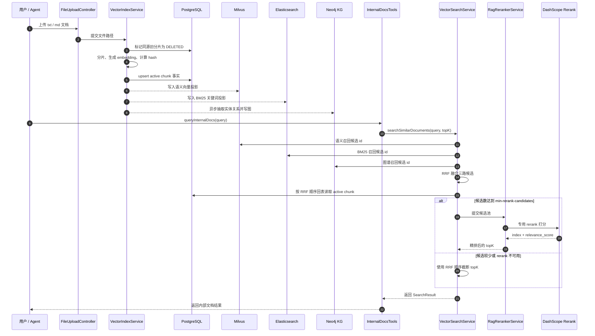
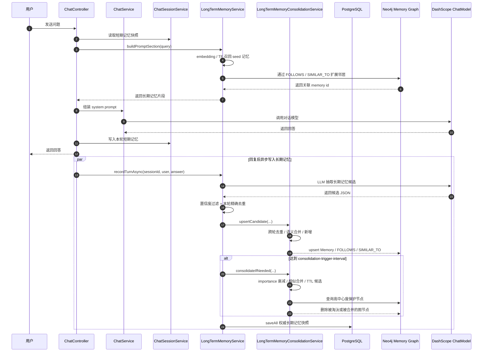

# Leap Agent

Leap Agent 是一个基于 Spring Boot 的 AI 助手后端服务，面向知识库问答和 AIOps 排障分析场景。项目集成 DashScope 对话与向量模型、Milvus 向量检索、Elasticsearch BM25、Neo4j Knowledge Graph、本地 Agent 工具，以及可选的 MCP 动态工具，通过 REST 和 SSE 接口对外提供能力。

项目当前包含一个轻量级静态测试页面，位于 `src/main/resources/static`。真正的核心能力在后端：文档上传、文档分片、向量化、混合检索、工具增强对话、分层记忆管理，以及自动化告警分析报告生成。
当前主 README 为中文版本；英文说明见 `README.en.md`。

## 核心能力

- 工具增强对话：支持普通响应和 SSE 流式响应。
- 分层记忆系统：按 session 维护短期记忆，维护全局偏好记忆，并通过 PostgreSQL + Neo4j Graph 承载长期语义记忆。
- 知识库检索：上传的 `txt` 和 `md` 文件会被分片后写入 PostgreSQL 事实源，并投影到 Milvus、Elasticsearch 和 Neo4j 做三路召回。
- AIOps 工作流：Supervisor Agent 协调 Planner 和 Executor Agent，结合告警、指标、日志和内部文档生成分析报告。
- 工具注册中心：通过统一的运行时注册类组装本地工具和 MCP 动态工具。
- 记忆调试接口：通过 `/api/chat/memory` 查看偏好、长期记忆、图统计和活动 session 概览。
- 静态测试页面：Spring Boot 直接托管一个浏览器测试 UI。

## 运行时架构

```text
Client / Static UI
       |
       v
api
  ChatController          REST 和 SSE 接口
  FileUploadController    文档上传入口
  MilvusHealthController  Milvus 健康检查
  SseEventSender          SSE 消息发送封装
       |
       v
domain
  chat                    对话模型创建、ReactAgent 创建、会话状态
  memory                  短期记忆、偏好记忆、长期记忆和记忆图治理
  aiops                   Supervisor / Planner / Executor 编排
  rag                     文档分片、向量化、索引、检索、RAG 生成
       |
       v
runtime.tool
  AgentToolRegistry       本地方法工具 + MCP 工具回调
  DateTimeTools           当前时间工具
  InternalDocsTools       基于 Milvus/ES/Neo4j + RRF/rerank 的内部文档检索
  QueryMetricsTools       Prometheus 告警和指标查询
  QueryLogsTools          CLS 风格日志主题和 Mock 日志查询
       |
       v
infra
  llm                     DashScope 集成配置
  milvus                  Milvus 客户端、集合 schema、索引
```

## 工程结构

```text
Leap Agent/
├── src/main/java/com/leap/agent/
│   ├── LeapAgentApplication.java      # Spring Boot 启动入口
│   ├── api/                           # HTTP API 层
│   │   ├── ChatController.java        # 对话、流式对话、AIOps 接口
│   │   ├── FileUploadController.java  # 知识文档上传
│   │   ├── MilvusHealthController.java# Milvus 健康检查
│   │   └── SseEventSender.java        # SSE 消息发送封装
│   ├── common/                        # 通用配置和 DTO
│   │   ├── config/                    # Web 与属性配置
│   │   └── model/                     # REST DTO、SSE 消息体、文档分片模型
│   ├── domain/                        # 应用领域服务
│   │   ├── aiops/                     # Supervisor / Planner / Executor 工作流
│   │   ├── chat/                      # 对话服务和 session 短期记忆管理
│   │   ├── memory/                    # 短期记忆、偏好记忆、长期记忆和图治理
│   │   └── rag/                       # 分片、向量化、PG/ES/Neo4j 投影、混合检索和 rerank
│   ├── infra/                         # 外部基础设施适配
│   │   ├── llm/                       # DashScope 配置
│   │   └── milvus/                    # Milvus 客户端、集合 schema、工具类
│   └── runtime/tool/                  # Agent 工具与工具注册中心
│       ├── AgentToolRegistry.java     # 本地工具 + MCP 工具回调
│       ├── DateTimeTools.java         # 日期时间工具
│       ├── InternalDocsTools.java     # 内部文档检索
│       ├── QueryMetricsTools.java     # Prometheus 告警和指标查询
│       └── QueryLogsTools.java        # CLS 风格日志查询
├── src/main/resources/
│   ├── static/                        # 浏览器测试 UI
│   ├── application.yml                # 本地运行配置
│   └── application-example.yml        # 配置示例
├── docs/
│   ├── aiops/                         # 示例 AIOps 知识文档
│   ├── archive/                       # 阶段性设计与实现归档
│   └── generated/                     # 生成的分析和参考文档
├── prometheus/                        # Prometheus 配置和告警规则
└── vector-database.yml                # Milvus + PostgreSQL + Elasticsearch + Neo4j 本地 compose 文件
```

## 主要请求链路

### 对话

1. `ChatController` 接收 `/api/chat` 或 `/api/chat_stream`。
2. `PreferenceMemoryService` 先同步执行规则抽取，保证当前这句用户输入里的偏好可以立即进入本轮 prompt。
3. `ChatSessionService` 加载或创建会话，并提供最近短期记忆快照。
4. `ChatService` 组装基础系统提示、全局偏好、短期记忆历史段，随后创建 DashScope chat model 和 ReactAgent。
5. `AgentToolRegistry` 注入本地方法工具和 MCP 工具回调。
6. 回复完成后写入短期记忆，并异步执行 LLM 偏好补充抽取；失败只记日志，不影响本轮响应。

### 文档上传与检索

1. `FileUploadController` 保存上传的 `txt` 或 `md` 文件。
2. `VectorIndexService` 读取文件，删除同源旧分片，执行文档分片、向量化，写入 PostgreSQL 事实源，并投影到 Milvus、Elasticsearch 和 Neo4j。
3. 当 Agent 需要内部知识时，`InternalDocsTools` 通过 `VectorSearchService` 执行 Milvus/ES/Neo4j 三路 RRF 召回，回 PostgreSQL 读取 active 分片，再用 DashScope 专用 rerank 精排。



### 长期记忆

1. 回复完成后，`LongTermMemoryService` 在异步线程中调用 LLM 抽取有长期复用价值的事实、排障案例和工具经验。
2. 抽取出的候选先经过置信度和本轮精确去重，再交给 `LongTermMemoryConsolidationService` 做跨轮去重、语义合并、新增入库和图投影。
3. PostgreSQL 是长期记忆事实源；Neo4j 只保存可重建的 Memory 节点和 FOLLOWS / SIMILAR_TO 等关系。
4. 治理触发时会执行 importance 衰减、相似记忆合并、TTL 淘汰，并通过 Neo4j 入度保护高中心度记忆。
5. 构建对话 prompt 时，长期记忆先按 embedding/TF 召回 seed，再通过 Neo4j 扩展关联记忆，最终只注入少量 active 条目。



### AIOps

1. `/api/ai_ops` 启动 AIOps 流程。
2. `AiOpsService` 构建 Planner 和 Executor ReactAgent，并交给 Supervisor Agent 调度。
3. 工具层提供当前时间、内部文档、Prometheus 指标/告警和日志查询能力。
4. 最终 Markdown 报告通过 SSE 流式返回。

## 记忆系统

- 短期记忆：`ChatSessionService` 以 `sessionId` 为粒度维护 `ShortTermMemory`，内部使用 typed message / snapshot，而不是裸 `List<Map<String, String>>`。
- 历史裁剪：每个 session 的窗口大小由 `memory.short-term.max-window-size` 控制，只保留最近 N 轮完整问答。
- 偏好记忆：`PreferenceMemoryService` 维护全局偏好缓存，通过 `PreferenceRepository` 抽象持久化，当前默认实现为本地 JSON 文件 `./data/preferences.json`。
- 固定槽位：`reply_language`、`reply_style`、`cls_region`、`time_range`、`service_scope` 继续承接可无损归一化的强 schema 偏好。
- 开放偏好：LLM 异步抽取会把“先给结论再给步骤”这类长期行为约定写入 `PreferenceItem`，避免污染固定 key 或堆进 `custom_rules` 大字符串。
- 长期记忆：`LongTermMemoryService` 只通过 LLM 异步抽取长期事实、排障案例和工具经验，不再用规则抽取写入长期记忆。
- 治理组件：`LongTermMemoryConsolidationService` 专管候选去重、语义合并、importance 衰减、TTL 淘汰、图中心度保护和相似边创建。
- 图增强：`Neo4jMemoryGraphClient` 维护 Memory 节点、FOLLOWS 和 SIMILAR_TO 关系；Neo4j 不可用时降级为纯长期记忆。
- Prompt 注入：`ChatService.buildSystemPrompt(...)` 当前按“基础系统提示 + 全局偏好 + 行为偏好 / 经验约定 + 长期记忆 / 相关事实 + 短期记忆 / 对话历史”拼装。
- 清理语义：`/api/chat/clear` 只清指定 session 的短期记忆，不清全局偏好。
- 观测接口：`GET /api/chat/memory` 返回全局偏好快照、偏好明细、开放偏好条目、长期记忆条目、图统计和活动 session 摘要；带 `sessionId` 参数时会额外返回该 session 的短期记忆明细。

## 环境要求

- Java 17
- Maven 3.9+
- Docker，或可访问的 Milvus、PostgreSQL、Elasticsearch、Neo4j 实例
- DashScope API Key
- 可选：本地 Prometheus，默认地址 `http://localhost:9090`
- 可选：用于日志工具的 MCP SSE endpoint

## 配置

应用读取 `src/main/resources/application.yml`。

关键配置如下：

```yaml
server:
  port: 9900

file:
  upload:
    path: ./uploads
    allowed-extensions: txt,md

milvus:
  host: localhost
  port: 19530
  database: default
  timeout: 10000

spring:
  ai:
    dashscope:
      api-key: ${DASHSCOPE_API_KEY:your-api-key-here}
    mcp:
      client:
        enabled: true
        type: ASYNC

dashscope:
  api:
    key: ${DASHSCOPE_API_KEY:your-api-key-here}
  embedding:
    model: text-embedding-v4

document:
  chunk:
    max-size: 800
    overlap: 100

rag:
  top-k: 3
  model: qwen3-max
  postgres:
    jdbc-url: jdbc:postgresql://localhost:5432/leap_agent
    username: leap
    password: leap
    init-schema: true
  elasticsearch:
    enabled: true
    base-url: http://localhost:9200
    index-name: leap_rag_chunks
  retrieval:
    rrf-k: 60
    fetch-multiplier: 2
    rerank-enabled: true
    rerank-provider: dashscope-rerank
    rerank-pool-multiplier: 4
    min-rerank-candidates: 20
    rerank-preview-len: 200
    rerank-model: qwen3-vl-rerank
    rerank-base-url: https://dashscope.aliyuncs.com/api/v1
    rerank-timeout-millis: 8000
    rerank-llm-fallback-enabled: true
  knowledge-graph:
    enabled: true
    uri: bolt://localhost:7687
    username: neo4j
    password: leap
    max-hops: 2

memory:
  short-term:
    max-window-size: 6
  preference:
    storage-path: ./data/preferences.json
    async-llm-enabled: true
  long-term:
    repository: postgres
    storage-path: ./data/long-term-memory.json
    postgres:
      jdbc-url: jdbc:postgresql://localhost:5432/leap_agent
      username: leap
      password: leap
      init-schema: true
      table-name: long_term_memory
    graph:
      enabled: true
      uri: bolt://localhost:7687
      username: neo4j
      password: leap
      init-schema: true
      similarity-edge-threshold: 0.80
      similar-scan-limit: 50
      neighbor-hops: 1
      centrality-protect-in-degree: 3
      graph-expanded-score: 0.45
    async-extraction-enabled: true
    async-llm-enabled: true
    prompt-top-k: 4
    min-recall-score: 0.42
    min-confidence: 0.7
    dedup-threshold: 0.92
    similarity-threshold: 0.80
    ttl-days: 30
    decay-rate: 0.995
    min-importance: 0.30
    consolidation-trigger-interval: 5

prometheus:
  base-url: http://localhost:9090
  mock-enabled: false

cls:
  mock-enabled: false
```

启动前设置 DashScope API Key：

```bash
export DASHSCOPE_API_KEY=your-api-key
```

## 本地启动

启动 Milvus、PostgreSQL、Elasticsearch、Neo4j 和 Prometheus：

```bash
docker compose -f vector-database.yml up -d
```

启动 Spring Boot 服务：

```bash
mvn spring-boot:run
```

打开静态测试页面：

```text
http://localhost:9900
```

健康检查：

```bash
curl http://localhost:9900/milvus/health
```

## API 参考

### 普通对话

```bash
curl -X POST http://localhost:9900/api/chat \
  -H "Content-Type: application/json" \
  -d '{"Id":"session-1","Question":"如何排查 CPU 使用率过高？"}'
```

响应结构：

```json
{
  "code": 200,
  "message": "success",
  "data": {
    "success": true,
    "answer": "...",
    "errorMessage": null
  }
}
```

### 流式对话

```bash
curl -N -X POST http://localhost:9900/api/chat_stream \
  -H "Content-Type: application/json" \
  -d '{"Id":"session-1","Question":"结合内部文档给我一个处理步骤"}'
```

SSE data 消息体：

```jsonl
{"type":"content","data":"..."}
{"type":"error","data":"..."}
{"type":"done","data":null}
```

### 清空会话

```bash
curl -X POST http://localhost:9900/api/chat/clear \
  -H "Content-Type: application/json" \
  -d '{"Id":"session-1"}'
```

### 查询会话信息

```bash
curl http://localhost:9900/api/chat/session/session-1
```

### 查看记忆快照

```bash
curl http://localhost:9900/api/chat/memory
curl "http://localhost:9900/api/chat/memory?sessionId=session-1"
```

接口会返回：

- 全局偏好键值快照
- 带来源、更新时间、版本号的偏好明细
- 开放偏好条目，包含 category、content、scope、confidence、source、version、status
- 长期记忆条目，包含 category、content、importance、confidence、source、version、status
- 长期记忆图统计，包含 graphLinked、graphInDegree、graphOutDegree
- 当前活动 session 摘要列表
- 指定 session 的短期记忆消息明细（仅在传入 `sessionId` 时返回）

### 上传知识文档

```bash
curl -X POST http://localhost:9900/api/upload \
  -F "file=@docs/aiops/cpu_high_usage.md"
```

支持的文件扩展名由 `file.upload.allowed-extensions` 控制。

### AIOps 报告

```bash
curl -N -X POST http://localhost:9900/api/ai_ops
```

接口会流式返回执行进度和最终 Markdown 报告。

## 内置 Agent 工具

| 工具类 | 用途 |
| --- | --- |
| `DateTimeTools` | 返回当前日期时间。 |
| `InternalDocsTools` | 通过 Milvus 语义召回、Elasticsearch 关键词召回、Neo4j KG 图召回、RRF 融合、PostgreSQL 回表和 DashScope 专用 rerank 检索内部知识库。 |
| `QueryMetricsTools` | 查询 Prometheus 告警和指标，支持 Mock。 |
| `QueryLogsTools` | 提供日志主题发现和 CLS 风格 Mock 日志查询。 |
| `AgentToolRegistry` | 统一组装本地工具和 MCP 动态工具回调。 |

## 开发说明

- `ChatSessionService` 使用内存保存每个 session 的短期记忆，服务重启后 session 历史会丢失。
- `PreferenceMemoryService` 会把全局偏好持久化到本地 JSON 文件，服务重启后会自动回放到进程内缓存。
- RAG 文档分片以 PostgreSQL 为事实源，Milvus/Elasticsearch/Neo4j 分别作为语义、关键词和图谱投影索引，查询链路为 RRF 融合后回表；候选数达到 `min-rerank-candidates` 才走 DashScope 专用 rerank，专用 rerank 失败时可退到 LLM 列表式重排或 RRF。
- `LongTermMemoryService` 负责长期记忆抽取、召回和持久化协调，`LongTermMemoryConsolidationService` 专管去重、合并、衰减、TTL 淘汰和图保护。
- `SseEventSender` 是 SSE 事件格式化和发送的唯一入口。
- `AgentToolRegistry` 是增删 Agent 工具的统一入口。
- `application-example.yml` 可作为配置模板。
- `docs/aiops/` 提供可上传到内部知识库的示例运维知识文档。
- `docs/archive/memory-system-v1.md` 记录了当前记忆系统的搭建边界与实现说明。
- `docs/generated/` 存放生成类分析和参考文档，例如成品项目记忆模块分析资料。

## 验证

编译项目：

```bash
JAVA_HOME=/Library/Java/JavaVirtualMachines/temurin-17.jdk/Contents/Home mvn clean compile -q
```

如果本地服务已经启动，可以做一个简单 smoke check：

```bash
curl http://localhost:9900/milvus/health
curl -X POST http://localhost:9900/api/chat \
  -H "Content-Type: application/json" \
  -d '{"Id":"smoke","Question":"现在是什么时间？"}'
```

## 项目信息

- 作者：Zhengcy05 <1825478405@qq.com>
- 当前版本：v1.2.0

## 版本迭代记录

| 版本 | 变更说明 |
| --- | --- |
| v1.2.0 | 参考成品项目重构 RAG 和长期记忆：RAG 采用 PostgreSQL 事实源、Milvus/ES/Neo4j 三路召回、RRF 融合和 DashScope 专用 rerank；长期记忆采用 PostgreSQL 事实源、Neo4j 图增强和独立治理组件。 |
| v1.1.0 | 落地 Memory Module V1：新增短期记忆、固定槽位 + 开放条目的全局偏好记忆、本地 JSON 偏好持久化、`/api/chat/memory` 调试接口，并将中文 README 设为主 README。 |
| v1.0.0 | 确立当前 Spring Boot Agent 工程结构，包含对话、SSE 流式输出、RAG 文档索引、AIOps 工作流、统一工具注册中心、英文 README 和中文 README。 |
